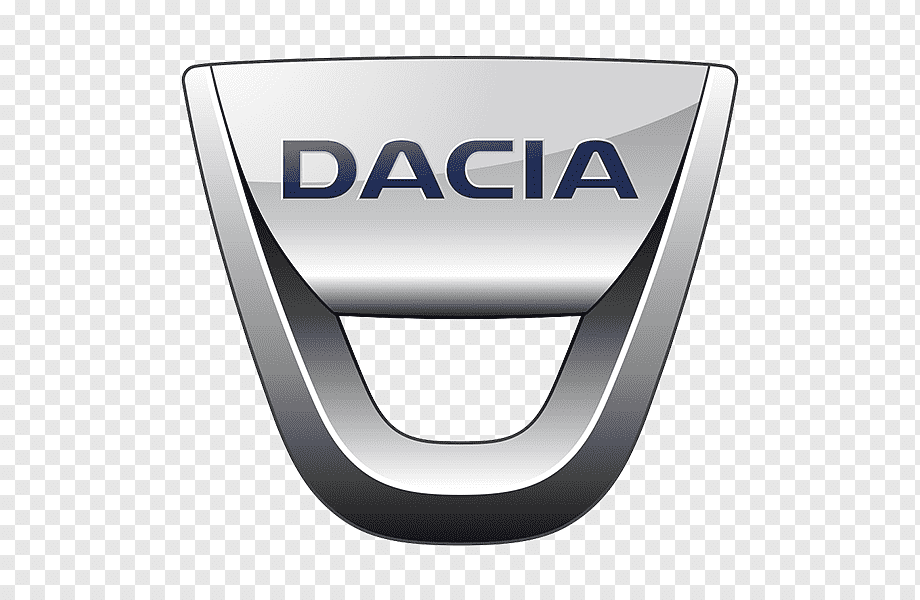

  

  

 
<h1 align="Center"><i>DDT4ALL</i></h1>
  
<h2 align="Center"><i>Любые манипуляции с ЭБУ автомобиля проводятся на ваш страх и риск!!!</i></h2>
  
<i> <a href="https://github.com/dimoroz772/DDT4ALL/blob/DDT4ALL/Option%20cache%20Renault%20russe.docx"><b>Manual for setting up additional functions on Renault cars</b></a> <i/>
  
<i> <a href="https://github.com/dimoroz772/DDT4ALL/releases/tag/Renault_Duster_1G"><b>Installer DDT4ALL for Renault Duster 1G</b></a> <i/>
  
<i> <a href="..."><b>Installer DDT4ALL for Renault and Dacia cars</b></a> <i/>
  
<i> <a href="..."><b>Installer DDT4ALL for Lada</b></a> <i/>
  
<i> <a href="..."><b>Manual for setting up additional functions on Lada Vesta cars</b></a> <i/>
  
<i> <a href="..."><b>Manual for setting up additional functions on Renault Arkana cars</b></a> <i/>
  
<i> <a href="..."><b>Manual for setting up additional functions on Renault Duster 1G cars</b></a> <i/>
  
<i> <a href="..."><b>Manual for setting up additional functions on Renault Duster 2G cars</b></a> <i/>
  
<i> <a href="..."><b>Manual for setting up additional functions on Renault Fluence (2009-2013) cars</b></a> <i/>
  
<i> <a href="..."><b>Manual for setting up additional functions on Renault Kaptur cars</b></a> <i/>
  
<i> <a href="..."><b>Manual for setting up additional functions on Renault Logan 2G cars</b></a> <i/>
  
<i> <a href="..."><b>Manual for setting up additional functions on Renault Megane 3 (2012-2014) cars</b></a> <i/>
  
<i> <a href="..."><b>Manual for setting up additional functions on Renault Sandero 2G (2013-2018) cars</b></a> <i/>
  
<i> <a href="..."><b>Installer Renault MediaNav Evolution Toolbox</b></a> <i/>
  
<h2 align="Center"><i>TEST MODE in MediaNav Evolution</i></h2>
  
<i> <a href="https://github.com/dimoroz772/DDT4ALL/blob/DDT4ALL/mcmtest_activate.ini"><b>mcmtest_activate.ini</b></a> <i/>
  
<i> <a href="https://github.com/dimoroz772/DDT4ALL/blob/DDT4ALL/mcmtest_activate_4medianav.ini"><b>mcmtest_activate_4medianav.ini</b></a> <i/>
  
<i> <a href="https://github.com/dimoroz772/DDT4ALL/blob/DDT4ALL/mcmtest_activate_4nng.ini"><b>mcmtest_activate_4nng.ini</b></a> <i/>
  
<i> <a href="https://github.com/dimoroz772/DDT4ALL/blob/DDT4ALL/%D0%98%D0%BD%D1%81%D1%82%D1%80%D1%83%D0%BA%D1%86%D0%B8%D1%8F.docx"><b>Интсрукция.docx</b></a> <i/>
  
<i> <a href="https://github.com/dimoroz772/DDT4ALL/blob/DDT4ALL/%D0%9A%D0%BE%D0%BC%D0%B1%D0%B8%D0%BD%D0%B0%D1%86%D0%B8%D1%8F.png"><b>Комбинация.png</b></a> <i/>
  
<i> <a href="https://github.com/dimoroz772/DDT4ALL/blob/DDT4ALL/%D0%9F%D0%BE%D1%81%D0%BB%D0%B5%D0%B4%D0%BE%D0%B2%D0%B0%D1%82%D0%B5%D0%BB%D1%8C%D0%BD%D0%BE%D1%81%D1%82%D1%8C.docx"><b>Последовательность.docx</b></a> <i/>
  
<i> <a href="https://github.com/dimoroz772/DDT4ALL/blob/DDT4ALL/upgrade.lgu"><b>Installing a media player on firmware 9.1.3</b></a> <i/>
  

# DDT4ALL
-----------------------------------------------------------------------------------------------------------------------------------------------------------
Любые манипуляции с ЭБУ автомобиля проводятся на ваш страх и риск!!!
-----------------------------------------------------------------------------------------------------------------------------------------------------------
[*Installer DDT4ALL for Renault and Dacia cars](https://github.com/dimoroz772/DDT4ALL/releases/tag/Renault_and_Dacia_cars)
-----------------------------------------------------------------------------------------------------------------------------------------------------------
[*Installer DDT4ALL for Lada](https://github.com/dimoroz772/DDT4ALL/releases/tag/Lada)
-----------------------------------------------------------------------------------------------------------------------------------------------------------
[*Manual for setting up additional functions on Lada Vesta cars](https://github.com/dimoroz772/DDT4ALL/blob/DDT4ALL/Lada_Vesta.docx)
-----------------------------------------------------------------------------------------------------------------------------------------------------------
[*Manual for setting up additional functions on Renault Arkana cars](https://github.com/dimoroz772/DDT4ALL/blob/DDT4ALL/Renault_Arkana.docx)
-----------------------------------------------------------------------------------------------------------------------------------------------------------
[*Manual for setting up additional functions on Renault Duster 1G cars](https://github.com/dimoroz772/DDT4ALL/blob/DDT4ALL/RD1G.docx)
-----------------------------------------------------------------------------------------------------------------------------------------------------------
[*Manual for setting up additional functions on Renault Duster 2G cars](https://github.com/dimoroz772/DDT4ALL/blob/DDT4ALL/RD2G.docx)
-----------------------------------------------------------------------------------------------------------------------------------------------------------
[*Manual for setting up additional functions on Renault Fluence (2009-2013) cars](https://github.com/dimoroz772/DDT4ALL/blob/DDT4ALL/RF.docx)
-----------------------------------------------------------------------------------------------------------------------------------------------------------
[*Manual for setting up additional functions on Renault Kaptur cars](https://github.com/dimoroz772/DDT4ALL/blob/DDT4ALL/RK.docx)
-----------------------------------------------------------------------------------------------------------------------------------------------------------
[*Manual for setting up additional functions on Renault Logan 2G cars](https://github.com/dimoroz772/DDT4ALL/blob/DDT4ALL/Renault_Logan_2G.docx)
-----------------------------------------------------------------------------------------------------------------------------------------------------------
[*Manual for setting up additional functions on Renault Megane 3 (2012-2014) cars](https://github.com/dimoroz772/DDT4ALL/blob/DDT4ALL/RM.docx)
-----------------------------------------------------------------------------------------------------------------------------------------------------------
[*Manual for setting up additional functions on Renault Sandero 2G (2013-2018) cars](https://github.com/dimoroz772/DDT4ALL/blob/DDT4ALL/RS.docx)
-----------------------------------------------------------------------------------------------------------------------------------------------------------
[*Installer Renault MediaNav Evolution Toolbox](https://github.com/dimoroz772/DDT4ALL/releases/tag/Renault_MediaNav_Toolbox_Evolution)
-----------------------------------------------------------------------------------------------------------------------------------------------------------
